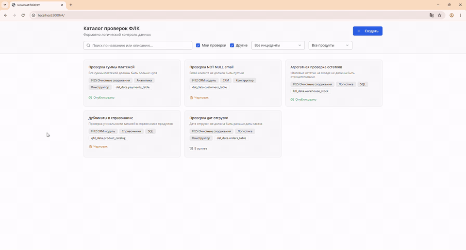

# ФЛК — форматно-логический контроль данных

Каталог правил проверки данных: создаёшь правило (конструктор или SQL), гоняешь тест, смотришь результат. Дипломный модуль; стек близок к data quality / ETL.

Без PostgreSQL тоже поднимается — **демо-режим** с данными в памяти.

## Архитектура

```
React (TS)  →  Express :5000  →  Flask :5001  →  PostgreSQL
                     │
                     └── если Flask недоступен → in-memory (демо)
```

| Режим | Что нужно |
|-------|-----------|
| **Демо** | Node 18+ |
| **Полный** | Node + Python 3.11 + PostgreSQL 14 |

## Быстрый старт (демо)

```bash
npm install
npm run dev
```

Открыть http://localhost:5000

Нужен Node 18+. На Windows `reusePort` в `server/index.ts` уже отключён.

## Демо

> GIF/скрин: положи `docs/demo.gif` (каталог → правило → тестовый прогон, 10–15 сек).

<!--  -->

## Полный режим (Flask + PostgreSQL)

### 1. DDL

```bash
psql -U postgres -d your_database -f flask_backend/ddl.sql
```

Создаёт схему `tech_data`, таблицы конфига/очереди/логов, функции проверки, seed из 5 правил.

### 2. Flask

```bash
cd flask_backend
cp .env.example .env
# заполни PG_* в .env
pip install -r requirements.txt
python app.py
```

Flask: порт **5001** (по умолчанию). При старте DDL накатывается идемпотентно.

### 3. Фронт

Из корня репо:

```bash
npm run dev
```

Express находит Flask на 5001 и проксирует `/api/*`.

## API

| Метод | URL | Описание |
|-------|-----|----------|
| GET | `/api/v1/rules` | Список (query: owner_id, incident_id, status, search) |
| GET | `/api/v1/rules/:id` | Одно правило |
| POST | `/api/v1/rules` | UPSERT |
| DELETE | `/api/v1/rules/:id` | Удаление |
| POST | `/api/v1/rules/test` | Тестовый прогон (в полном режиме — SQL в БД) |
| GET | `/api/v1/metadata/tables` | Дерево схем/таблиц |
| GET | `/api/health` | Healthcheck Flask + БД |

## Стек

- **UI:** React 18, TypeScript, Tailwind, shadcn/ui, Vite  
- **Node:** Express — Vite HMR + прокси на Flask  
- **Python:** Flask, psycopg2  
- **БД:** PostgreSQL 14  

## Структура

```
data-quality-rules/
├── client/src/pages/     # catalog, rule-edit
├── server/               # Express + in-memory fallback
├── flask_backend/        # Flask API, db.py, ddl.sql
├── shared/schema.ts      # общие типы
└── docs/                 # demo.gif (добавить)
```

## Ограничения

- Авторизация заглушка: `user_id = 'admin'`
- Дерево таблиц в полном режиме из `information_schema`, иначе статический fallback
- Тестовый прогон в демо — имитация, в полном — реальный SQL
